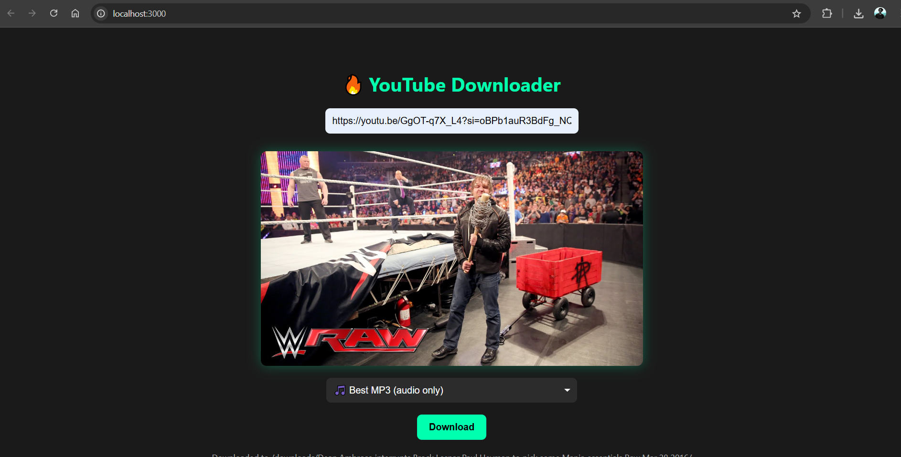

# YouTube Downloader App

🔥 YouTube video downloader built with Node.js and Express, leveraging `yt-dlp` and `ffmpeg` binaries (bundled locally) to allow users to download best quality MP4 videos or MP3 audio, straight from the browser.

---

## 🚀 Features

- Paste any valid YouTube URL and preview the thumbnail instantly.
- Choose format: Best quality video (MP4) or audio (MP3).
- Automatically converts audio to `.mp3` using bundled FFmpeg.
- Downloads are served directly in-browser (no saving to disk).
- Temporary files are deleted after sending to user.
- Clean, modern UI with real-time status updates.

---

## 📁 Project Structure

```
Youtube Downloader App
├── public/                # Frontend page
├── temp/                  # Temporary download storage
├── ffmpeg/                # FFmpeg binaries (Windows)
│   └── bin/ffmpeg.exe
├── yt-dlp                 # yt-dlp linux binary
├── server.js              # Node.js + Express backend
└── README.md              # This file
```

---

## 🛠 Requirements

- Node.js (v24 or higher)
- No need to install yt-dlp or ffmpeg globally (binaries included)

> ⚠️ If deploying to Linux (e.g., Render), use platform-specific binaries instead of `.exe`.

---

## ⚙️ Usage

1. Clone the repo:

```bash
git clone https://github.com/rumoursbehindme/youtube-downloader.git
```

2. Navigate to the directory:

```bash
cd youtube-downloader
```

3. Install dependencies:

```bash
npm install
```

4. Start the server:

```bash
npm start
```

5. Open browser:

```
http://localhost:3000
```


## 🧠 Tech Stack

- **Frontend**: HTML + Vanilla JS + CSS
- **Backend**: Express.js (Node.js)
- **Download Engine**: yt-dlp + ffmpeg (local binaries)

---

## 📸 Screenshots



---

## 📄 License

[MIT](LICENSE)

---

## 💡 Credits

- [yt-dlp](https://github.com/yt-dlp/yt-dlp)
- [ffmpeg](https://ffmpeg.org/)
- Design + Dev by **Rajeev Hegde**
